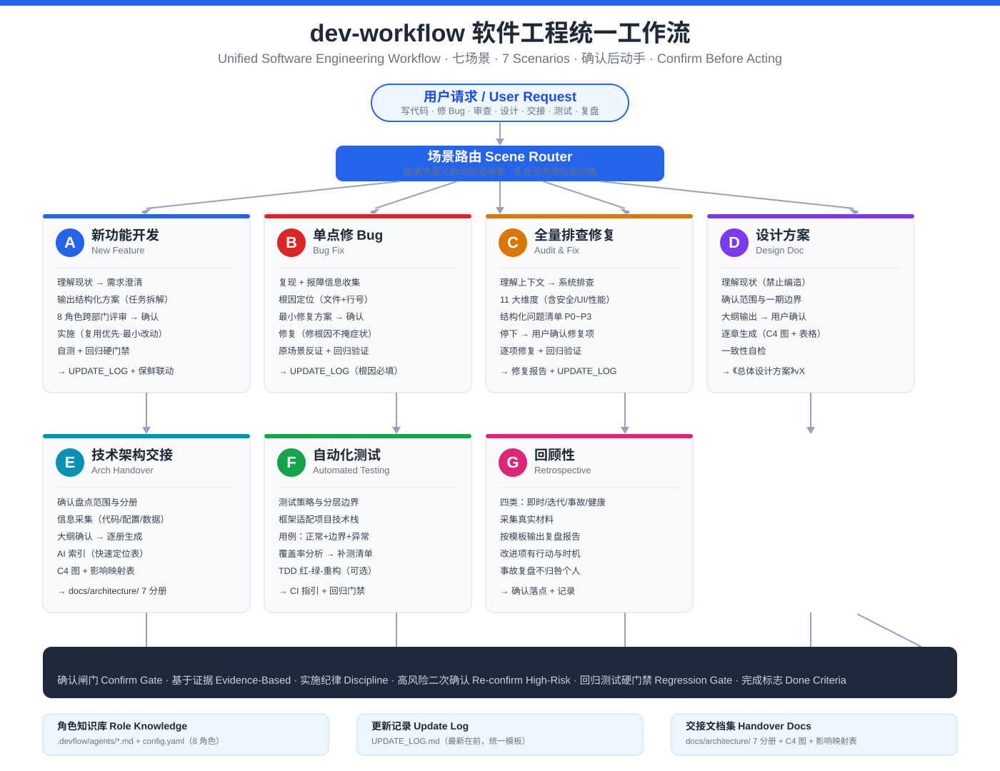
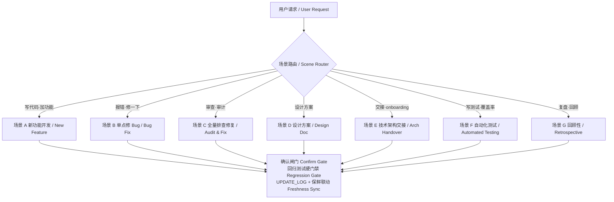

# 🛠️ dev-workflow — 软件工程统一工作流 · Unified Software Engineering Workflow

> 面向 AI 编程助手的「软件工程统一工作流」Skill：将新功能开发、Bug 修复、全量排查、方案设计、架构交接、自动化测试、复盘回顾七类任务，收敛为**一套可强制执行的标准化流程**——先理解现状、再输出方案、经用户确认后才动手、回归测试全部通过才算完成。
>
> A workflow skill for AI coding assistants: it converges seven types of tasks — new feature development, bug fixing, full audit, design docs, architecture handover, automated testing, and retrospectives — into **one enforceable, standardized process**: understand first, propose a plan, act only after user confirmation, and consider a task done only when regression tests all pass.


## 🧩 .skill 文件
> .skill 文件是一种技能包格式，常用于某些 AI 平台（如 AI 助手、聊天机器人框架等），用来扩展 AI 的能力。比如你可以把“代码审查”、“工作流自动化”、“文档生成”等功能打包成一个 .skill 文件，然后 AI 就可以加载并调用它。
> 所以，当你看到 dev-workflow.skill 时，完全可以把它当成一个“技能压缩包”来理解，就像安卓的 .apk 本质上也是一个 zip 文件一样。如果你需要手动修改内容，解压后重新打包成 zip 再改回 .skill 即可。

---

## 🗺️ 架构总览 · Architecture Overview





---

## ✨ 特性一览 · Features

| 中文 | English |
|---|---|
| **七场景统一路由** —— 按请求语义自动路由到 A~G 场景手册，复合任务按阶段切换场景 | **7-scenario unified routing** — auto-routes requests to scenario handbooks A–G; compound tasks switch scenarios per phase |
| **确认闸门** —— 未经用户明确确认，不修改任何代码、不产出正式文档；方案永远先于实施 | **Confirm gate** — no code changes or final documents without explicit user confirmation; plans always precede action |
| **基于证据，不臆测** —— 结论引用具体文件与行号；文档禁止编造技术栈、版本号、表结构，缺失信息标注 `【待确认】` | **Evidence-based** — conclusions cite specific files and line numbers; no fabricated stack/version/schema; missing info is marked `[TBD]` |
| **8 角色跨部门评审** —— 前端 / 后端 / DBA / QA / 架构师 / DevOps / 安全 / 产品，实施前按关注点矩阵评审，协作纪要随方案一并确认 | **8-role cross-functional review** — frontend/backend/DBA/QA/architect/DevOps/security/product review before implementation; minutes confirmed with the plan |
| **回归测试硬门禁** —— 改动点反证 + 受影响路径回归 + 相关自动化用例，全部通过才算完成任务 | **Regression gate** — counter-proof of the change, regression of affected paths, and all related automated cases must pass |
| **文档保鲜联动** —— 每次变更自动联动更新交接文档、C4 架构图、角色知识库 | **Doc freshness sync** — every change updates handover docs, C4 diagrams, and role knowledge bases |
| **12 章编码规范** —— 命名 / 安全 / 接口 / 数据库 / 性能 / 依赖 / 配置等强制检查项，不满足不得宣称完成 | **12-chapter coding standards** — mandatory checks on naming/security/API/DB/performance/deps/config |

---

## 🧭 场景路由 · Scenario Routing

| 场景 Scenario | 适用请求（示例） Typical Requests | 流程一句话 One-line Flow |
|---|---|---|
| **A 新功能开发** New Feature | 写代码、加功能、实现需求、重构、优化、性能调优 / write code, add features, refactor, optimize, tune performance | 理解现状 → 需求澄清 → 方案 → 确认 → 实施 → 自测+回归 / understand → clarify → plan → confirm → implement → test & regress |
| **B 单点修 Bug** Bug Fix | 报错、某功能有问题、帮我修一下 / an error, a broken feature, fix this | 复现收集 → 根因定位 → 最小修复方案 → 确认 → 修复 → 回归验证 / reproduce → root cause → minimal fix → confirm → fix → verify |
| **C 全量排查修复** Audit & Fix | 代码审查、审计、UI 走查、可用性/无障碍、安全审计、debug / code review, audit, UI walkthrough, a11y, security audit, debug | 理解上下文 → 11 维排查 → 问题清单 → 确认 → 修复 / understand → 11-dimension scan → issue list → confirm → fix |
| **D 设计方案** Design Doc | 总体设计、系统设计、架构设计、技术方案 / overall design, system design, architecture, technical proposal | 理解现状 → 确认范围 → 大纲确认 → 逐章生成 → 一致性自检 / understand → scope → outline OK → chapters → consistency check |
| **E 技术架构交接** Arch Handover | 架构盘点、交接文档、新人文档、onboarding / inventory, handover docs, onboarding | 范围确认 → 信息采集 → 大纲确认 → 逐册生成 → AI 索引 → 保鲜映射 / scope → collect → outline OK → volumes → AI index → freshness map |
| **F 自动化测试** Automated Testing | 单测、集成测试、E2E、覆盖率、TDD、CI 测试 / unit, integration, E2E, coverage, TDD, CI | 策略 → 用例编写/执行 → 覆盖率补测 → CI 指引 → 回归门禁 / strategy → cases → coverage → CI guide → regression gate |
| **G 回顾性** Retrospective | 复盘、回顾、事故复盘、项目健康度 / retrospective, post-mortem, health check | 选定类型 → 采集材料 → 输出报告 → 确认落点 / type → materials → report → archive |

---

## 🚀 快速开始 · Quick Start

### 环境要求 · Requirements

- 支持 Agent Skills（SKILL.md 目录结构）的 AI 编程助手，如 **opencode**、**Claude Code**、**OpenAI Codex**、**WorkBuddy** 等 / An AI assistant supporting Agent Skills (SKILL.md layout), e.g. opencode, Claude Code, OpenAI Codex, WorkBuddy;
- 无任何第三方运行时依赖 / No third-party runtime dependencies.

### 安装 · Install

> 本技能采用业界通用的 SKILL.md 目录结构（`SKILL.md` + `references/` + `assets/`），可被大多数支持 Agent Skills 的工具直接识别。以下以 **opencode** 为主，其他平台见文末速查表。
>
> This skill follows the standard SKILL.md layout (`SKILL.md` + `references/` + `assets/`), so it works out of the box on most Agent Skills–capable tools. The guide below focuses on **opencode**; a quick reference for other platforms follows.

#### ① opencode（主要 · Primary）

**全局安装（所有项目可用）/ Global install (available in every project)**

```bash
# 1. 克隆本仓库 / Clone the repository
git clone https://github.com/<your-org>/dev-workflow.git
cd dev-workflow

# 2. 全局安装到 ~/.config/opencode/skills/<name>/SKILL.md
mkdir -p ~/.config/opencode/skills
cp -r dev-workflow ~/.config/opencode/skills/
```

**项目级安装（仅当前项目）/ Project-level install (current repo only)**

```bash
# 项目内：.opencode/skills/<name>/SKILL.md
mkdir -p .opencode/skills
cp -r dev-workflow .opencode/skills/
```

> opencode 会自动发现上述位置的 skills 并按需加载，无需额外配置；技能名 `dev-workflow` 符合 opencode 命名规范（小写字母 / 数字 + 连字符）。新开会话即生效。
>
> opencode auto-discovers skills in these locations and loads them on demand — no extra config needed. The skill name `dev-workflow` complies with opencode's naming rules (lowercase alphanumerics + hyphens) and takes effect in new sessions.

#### ② 其他平台速查 · Other platforms at a glance

| 平台 Platform | 安装命令 Install Command | 生效方式 Activation |
|---|---|---|
| **Claude Code** | `cp -r dev-workflow ~/.claude/skills/` | 重启会话生效 / restart the session |
| **OpenAI Codex** | `cp -r dev-workflow ~/.codex/skills/` | 新会话自动加载（亦可 `$dev-workflow ...` 显式调用）/ auto-loaded in new sessions (or invoke via `$dev-workflow ...`) |
| **WorkBuddy** | `cp -r dev-workflow ~/.workbuddy/skills/` | 重启会话生效 / restart the session |

**从 .skill 压缩包安装 / Install from the .skill archive**

```bash
# .skill 包内含顶层 dev-workflow/ 目录，解压即得完整 skill
unzip dev-workflow.skill -d ~/.config/opencode/skills/   # opencode
unzip dev-workflow.skill -d ~/.claude/skills/            # Claude Code
unzip dev-workflow.skill -d ~/.codex/skills/             # OpenAI Codex
unzip dev-workflow.skill -d ~/.workbuddy/skills/         # WorkBuddy
```

### 使用 · Usage

重启会话后无需任何命令，直接提需求即可自动路由到对应场景 / After restarting the session, no commands are needed — just state a request and the workflow routes automatically:

```text
"帮我加一个邮箱验证码登录的功能"      → 场景 A 新功能开发 / New Feature
"Add an email verification-code login"   → A
"这个按钮点击没反应，修一下"          → 场景 B 单点修 Bug / Bug Fix
"帮我全面审查一下这个项目的代码"      → 场景 C 全量排查修复 / Audit & Fix
"写一份系统的总体设计方案"            → 场景 D 设计方案 / Design Doc
"给新人写一份项目交接文档"            → 场景 E 技术架构交接 / Arch Handover
"给核心模块补上单元测试"              → 场景 F 自动化测试 / Automated Testing
"复盘一下这个迭代"                    → 场景 G 回顾性 / Retrospective
```

---

## 📁 目录结构 · Directory Structure

```text
dev-workflow/
├── SKILL.md                        # 总纲：统一底线 + 场景路由表 + 共享规范 / Master guide: principles + routing + shared specs
├── references/                     # 场景手册 & 支持手册 / Scenario & support handbooks
│   ├── new-feature.md              # A 新功能开发 / New Feature
│   ├── bug-fix.md                  # B 单点修 Bug / Bug Fix
│   ├── audit-fix.md                # C 全量排查修复（11 大排查维度）/ Audit & Fix (11 dimensions)
│   ├── design-doc.md               # D 设计方案 / Design Doc
│   ├── design-doc-template.md      #   《总体设计方案》模板 / Design doc template
│   ├── arch-handover.md            # E 技术架构交接 / Arch Handover
│   ├── arch-handover-template.md   #   交接文档集模板（7 分册 + 影响映射表）/ Handover set template (7 volumes + impact map)
│   ├── automated-testing.md        # F 自动化测试（含回归硬门禁细则）/ Automated Testing (incl. regression gate)
│   ├── retrospective.md            # G 回顾性（4 类复盘模板）/ Retrospective (4 templates)
│   ├── agents.md                   # 8 角色体系与跨角色沟通评审 / 8-role system & cross-role review
│   ├── agent-knowledge-template.md # 角色知识库模板 / Role knowledge-base template
│   ├── coding-standards.md         # 12 章编码规范与实施纪律 / 12-chapter coding standards
│   └── diagrams.md                 # 图表规范（C4 / Mermaid / PlantUML）/ Diagram specs
└── assets/                         # 共享模板 / Shared templates
    ├── dev-workflow-overview.png   # 架构总览图 / Architecture overview diagram
    ├── PLAN_TEMPLATE.md            # 实现方案模板 / Implementation plan template
    ├── UPDATE_LOG.md               # 更新记录模板 / Update log template
    └── agent-config-template.yaml  # 角色 → 模型映射配置 / Role → model mapping config
```

---

## 🛡️ 核心底线 · Core Principles（跨场景不变 / Applies to all scenarios）

1. **确认闸门 Confirm Gate** —— 未经用户明确确认，不修改任何代码、不产出正式文档正文 / No code changes or document content without explicit user confirmation;
2. **基于证据 Evidence-Based** —— 结论引用具体文件与行号，不凭印象判断；文档禁止编造，缺失信息标注 `【待确认】` / Conclusions cite files & line numbers; no fabrication; missing info marked `[TBD]`;
3. **实施纪律 Discipline** —— 复用优先 → 最小改动 → 不顺手重构 → 保持兼容 → 新依赖先确认 / reuse-first → minimal changes → no drive-by refactors → backward compatible → new deps confirmed first;
4. **高风险二次确认 Re-confirm High-Risk** —— 删除代码、修改公共接口签名 / 数据库结构 / 配置文件 / 共享函数，逐项单独确认 / deletions, public API/DB/config/shared-function changes each get a separate confirmation;
5. **测试失败修正规则 Fix-on-Failure** —— 方案范围内直接修正并报告；范围外回到确认闸门 / in-scope fixes go straight in; out-of-scope returns to the confirm gate;
6. **回归测试硬门禁 Regression Gate** —— 改动点反证 + 受影响路径回归 + 相关自动化用例全部通过，才允许宣布完成 / counter-proof + affected-path regression + all related automated cases pass before "done";
7. **完成标志 Done Criteria** —— 自测通过 + 回归通过 + `UPDATE_LOG.md` 记录逐条一致 + 交接文档联动更新 / self-test + regression pass + `UPDATE_LOG.md` consistent + handover docs synced.

---

## 🏗️ 使用后项目内沉淀 · Project Artifacts

| 产物 Artifact | 位置 Location | 说明 Description |
|---|---|---|
| 角色知识库 Role Knowledge | `.devflow/agents/*.md` | 8 角色按项目生成的领域知识，首用生成、变更后保鲜更新 / per-role domain knowledge, generated on first use, kept fresh on changes |
| 模型映射 Model Mapping | `.devflow/agents/config.yaml` | 角色 → AI 模型映射（留空使用平台默认）/ role → model mapping (blank = platform default) |
| 更新记录 Update Log | `UPDATE_LOG.md` | 每次变更的结构化记录（最新在前，统一模板）/ structured change history (newest first) |
| 交接文档集 Handover Docs | `docs/architecture/` | README 导航 + 7 分册 + C4 架构图 + 影响映射表 / README nav + 7 volumes + C4 diagrams + impact map |
| 架构图源文件 Diagram Sources | `docs/architecture/diagrams/` | Mermaid / PlantUML 源文件 + 图清单表 / source files + diagram registry |

---

## 📚 配套生态 · Ecosystem

| 任务 Task | 建议使用 Recommended Skill |
|---|---|
| 写代码 / 修 bug / 排查 / 设计 / 交接文档 / 测试 / 复盘 / coding, fixing, auditing, designing, handover, testing, retro | **dev-workflow**（本技能 / this skill） |
| 整理工作区改动为规范 commit / organized commits | git-commit-workflow |
| 渗透测试与安全验证编排 / pentest & security verification | web-pentest-orchestrator |
| 教学式讲解 / Socratic teaching | socratic-teaching |

---

## 📄 License

[MIT](LICENSE)
