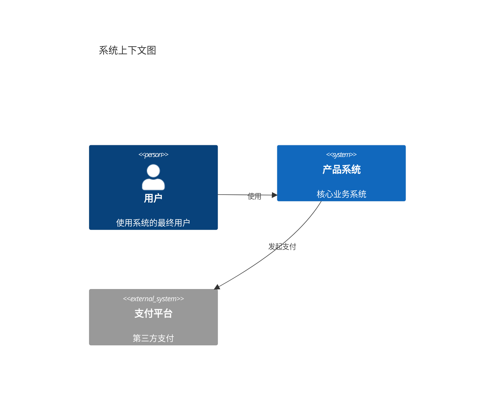

# 图表规范手册（架构图 / C4 / PlantUML）

> 本手册在总纲（SKILL.md）底线之上执行：基于证据（禁止编造）、确认后产出均按总纲执行，本手册不再重复展开。
> 适用范围：场景 D（设计方案）与场景 E（技术架构交接）中所有图表；场景 A/B 方案中的简单流程图参照本手册的 Mermaid 约定。

## 一、语言选型决策表

| 图类型 | 首选语言 | 说明 |
|---|---|---|
| C4 架构图（Context / Container / Component / Code） | Mermaid（官方 C4 语法） | 开箱渲染，语法见第二节 |
| ER 图 | Mermaid `erDiagram` | |
| 时序图 / 流程图 / 状态机 | Mermaid `sequenceDiagram` / `flowchart` / `stateDiagram-v2` | |
| 部署图 / 拓扑图（复杂布局） | PlantUML（备选） | `.puml` 源文件 + 渲染指引见第四节 |
| 甘特图等 Mermaid 表达力不足的特殊图 | PlantUML（备选） | 同上 |

选择原则：**优先 Mermaid（查看方开箱渲染、AI 生成最成熟）；仅当 Mermaid 布局或表达力不足（如精细部署图）时用 PlantUML**。同一文档集内图的风格保持统一，不混用两种语言表达同类图。

## 二、C4 分层标准

| 层级 | 画什么 | 读者 |
|---|---|---|
| Level 1 Context | 本系统与外部用户 / 系统的关系 | 所有人 |
| Level 2 Container | 应用、服务、数据库、消息队列等容器及交互 | 技术团队 |
| Level 3 Component | 单个容器内部的模块 / 组件及依赖 | 开发 |
| Level 4 Code | 关键类 / 接口（仅对最复杂的部分画，按需） | 开发 |

绘制要求：

- 中文标注，英文术语括注（如「订单服务 (order-service)」）；
- 每张图附一行说明与关键决策标注；层间下钻关系标注"本图下一层见 §X"；
- **图必须基于真实材料**：扫描代码结构 / 配置文件 / 部署文件后绘制，禁止编造组件与关系；不确定项标注 `【待确认】`；
- 设计文档（场景 D）画目标架构、交接文档（场景 E）画现状架构——同一系统两者并存时，在图上标注"现状 / 目标"。

Mermaid 官方 C4 语法示例（Level 1 Context）：

完整语法参考 Mermaid 官方文档（C4 Diagram，含 C4Container / C4Component 等）。

## 三、图源资产管理

- 图源文件统一放 `docs/architecture/diagrams/`，命名 `<c4层级|图类型>-<主题>.<mmd|puml>`（如 `c2-order-service.mmd`、`deploy-topology.puml`）；
- 文档内嵌图时，图下标注源文件路径（如 `图源：docs/architecture/diagrams/c2-order-service.mmd`）；
- 维护「图清单表」（放 `docs/architecture/diagrams/README.md`，文档集 README 导航中链接）：

| 图 | 类型 | C4 层级 | 源文件 | 嵌入文档章节 |
|---|---|---|---|---|
| 系统上下文图 | C4Context | L1 | c1-context.mmd | 02 技术架构 §2.1 |

- 图清单表纳入「影响映射表」（见 arch-handover-template.md 附录 A）：代码变更影响模块 → 检查关联图是否需同步更新（**图与文档一起保鲜**）。

## 四、渲染与验证

- 要求：输出**语法可验证**的源码，禁止输出明显语法错误的图；
- 验证途径（不强制实际渲染，但交付前必须自查语法）：
  - Mermaid：https://mermaid.live/ 粘贴验证；
  - PlantUML：官方服务器 https://www.plantuml.com/plantuml/ 、统一渲染服务 https://kroki.io/ 、VS Code PlantUML 插件、Docker `plantuml/plantuml-server`；
- 交付时附一行渲染指引（如"此图可在 mermaid.live 查看 / Kroki 渲染"）；
- 目标查看平台不支持渲染时（如 GitHub 不渲染 PlantUML），以源文件 + 渲染指引交付，并在文档内给出替代说明。

## 五、AI 生成约束与自检

- [ ] 图基于真实代码 / 配置 / 部署材料，无编造组件
- [ ] C4 层级选择正确（该层画该层，不混层）；现状 / 目标已标注
- [ ] 中文标注 + 术语括注；命名与文档正文一致
- [ ] 图源文件已落盘并符合命名规范；图清单表已登记
- [ ] 语法已自查（mermaid.live / PlantUML 渲染器）；渲染指引已附
